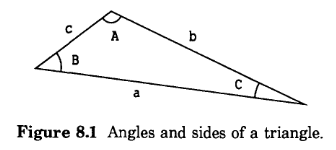

# 8 重新定义CLOS元素

要重新定义CLOS的元素，就是在元素(方法)已经存在时计算一个新的定义形式(例如`defmethod`形式)。通常，CLOS会用新的定义替换旧的定义。

重新定义类和方法的能力对软件开发至关重要。它允许你继续完善你的设计一个正在运行的程序，即使你已经创建了实例;当一个类被重新定义时，任何现有的实例都被更新为新的定义。通常，设计面向对象程序最具挑战性的部分是选择正确的模块化。有时，当您开始编写方法时，您会想到更好的类组织，从而产生更多的模块化代码。CLOS支持一种灵活的方法来重新定义类——类和方法，因此您可以自由地修改原始设计，包括修改类的组织。

在本章中，我们给出了一个重新定义类的例子，将实例更新为新的类定义，并重新定义受影响的方法。本例的第一个目标是说明重新定义CLOS元素的机制。第二个目标是给出一些设计程序的指导方针，其中大多数元素是相互独立的;在这样的程序中，可以重定义一个元素而不影响其他大多数元素。

## 8.1 重新定义类

如果对`defclass`形式求值，且该名字的类已经存在，则新类定义将替换旧类定义。您可以重新定义一个类来更改它的任何方面，包括它的槽、它的超类、它的访问器方法和任何`defclass`选项。

**重新定义对什么有影响**

请注意，更改类定义会影响类的所有子类，因为它们继承了类的结构。因为类控制其实例的结构，所以类和子类的所有实例都受到影响。此外，由于`defclass`选项为读取器和写入器定义了方法，这些方法也可能受到重新定义类的影响。当重新定义类时，CLOS自动将更改传播到受影响的所有内容，包括子类、类和子类的实例以及访问器的方法。

**访问器方法会发生什么**

任何由旧类定义创建的(通过`:accessor`、`:reader`或`:writer`槽选项创建)但新类定义没有请求的访问器方法都将从泛型函数中删除。

**实例自动更新**

当重新定义类，使实例的结构发生变化时(例如，当添加或删除槽时)，类及其子类的所有实例都必须更新为新的结构。CLOS自动更新实例。

CLOS指定每个实例的更新发生在对该实例的任何槽进行读写访问之前的某个时间。虽然不能假设实例的更新在计算新类定义时立即发生，但其效果在语义上是相同的;保护您永远不会访问过时的实例。

CLOS根据需要更新实例，而不是一次更新所有实例。因此，CLOS不需要跟踪类的所有实例，任何未引用的实例都可以被垃圾收集。

**现有实例的槽会发生什么**

重定义类时，新定义中指定的槽可能与旧定义中的槽不同。常见的有三种情况:

- 如果在两个定义中指定了相同的槽，则保留槽的值。

- 当一个槽由新的定义指定，而旧的定义没有指定时，这个槽被添加到实例中，并根据`:initform`选项进行初始化。

- 当旧定义中指定的槽没有被new指定时，该槽将从实例中删除，任何值都将被丢弃。然而，被删除的槽的值不会立即被丢弃;您可以通过编写自定义更新的方法来访问它们。

我们在表8.1中总结了这些信息，它也显示了当槽的分配类型从本地更改为共享或从共享更改为本地时发生了什么。表8.1中的条目具有如下含义:

- preserved 槽的值在实例更新前后是相同的。如果槽以前被解除绑定，那么在更新之后它仍然被解除绑定。

- initialized 如果槽是由类指定的或继承自超类，则该槽接收`:initform`的值。如果没有`:initform`，表示该槽的值被解除绑定。

- discarded 槽从实例中删除，其值丢失。

|              | Shared (New) | Local (New) | None (New) |
|------------- | ------------ | ----------- | ---------- |
| shared (old) | preserved    | preserved   | discarded  |
| local (old)  | initialized  | preserved   | discarded  |
| non (old)    | initialized  | initialized | no action  |

**定制更新**

CLOS使您能够指定在更新实例以符合类的新定义时要采取的其他操作。为此，你可以提供一个方法`update-instance-for-redefined-class`，以便在更新实例时做进一步的工作。在方法体中可以访问被丢弃的槽的值，你可以用这些值来初始化其他槽。

当重新定义类时，CLOS更新类和子类的结构(如果需要)，并删除或添加访问器方法(如果需要)。CLOS通过添加新的槽和删除过时的槽更新每个实例的结构(更新发生在下一次访问实例的槽之前，具体时间与实现相关)。最后，CLOS调用用于泛型函数 `update-instance-for-redefined-class`。`update-instance-for-redefined-class`的默认 primary 方法以前面描述的方式初始化槽。

在大多数情况下，用户应该为`update-instance-for-redefined-class`提供 before 或 after 方法，而不是 primary 方法。primary 方法将覆盖初始化新槽的默认方法，并阻止通常的初始化发生。如果在 before 方法中初始化槽，默认的 primary 方法不会用它的 initform 填充槽。

您可以定制`update-instance-for-redefined-class`，以便根据被丢弃的槽值将值存储在新的槽中。作为一个简单的例子，为了重命名一个槽，你可以写一个方法来存储被丢弃的槽的值到新的槽。

`update-instance-for-redefined-class`泛型函数有四个必需参数和一个`&rest`参数:

*instance* 被更新到新结构的实例

*added-slots* 添加的槽的的列表

*discarded-slots* 被丢弃的槽的列表

*property-list* 一个 plist，包含被废弃的槽的名字和值的对（不包括任何被取消绑定的废弃的槽 ），以及所有在旧的定义中定义为 local, 在新的定义中被定义为共享的槽。

*&rest initargs* `&rest`参数很少使用;我们在第168页[执行initargs初始化]()中讨论过

最有用的参数是 property-list，它提供了一种访问被丢弃的槽值的方法。有关重定义类和为重定义类的`update-instance-for-redefined-class`示例，请参阅第144页[重定义CLOS元素的示例]()。

## 8.2 重新定义方法和泛型函数

**方法**

在求值`defmethod`形式的时候，如果对于同一个泛型函数已经存在相同的方法，且具有相同的参数专用性和相同的限定符，则新的方法定义将会替换掉旧的方法定义。

未来对泛型函数的调用看到的都是该方法的新定义。如果在执行泛型函数本身期间重新定义该方法，则其效果是不可预测的。许多CLOS实现对泛型调度的部分进行了优化，因此新方法定义可能不会用于这个泛型函数调用。

**泛型函数**

如果你求值一个`defgeneric`形式, 并且已经存在一个同名的泛型函数，`defgeneric`会重新定义现有的泛型函数。如果泛型函数的任何方法与`defgeneric`指定的 lambda-list 不一致，则会发出错误信号。当你重新定义一个泛型函数时，泛型函数的新定义将取代旧的定义。

`defgeneric`可以通过包含`:method`选项来定义方法。`defgeneric`的`:method`选项与使用`defmethod`为该泛型函数定义方法的效果相同。有时，在`defgeneric`形式中定义方法本身是有用的，特别是对于默认方法。这是一种突出显示默认行为的方法。有关使用该语法的示例，请参见[定义定向流]()，第180页。

如果重新定义泛型函数，并且新的`defgeneric`形式使用`:method`选项，可能会发生两件事。如果该方法已经存在(具有相同的专门化参数和相同的限定符的相同泛型函数的方法)，则它将被`:method`选项中定义的方法替换。如果该方法还不存在，则创建它。重新定义泛型函数可能会向泛型函数添加方法，也可能会替换方法，但它永远不会删除已有的方法:如果以前的`defgeneric`用`:method`选项定义了一个方法，但当前的`defgeneric`没有定义该方法，该方法对象继续存在于 Lisp 中。

您不能使用`defgeneric`来重新定义普通的 Lisp 函数、宏或特殊形式。如果对`defgeneric`形式求值，并且第一个参数是普通函数、宏或特殊形式的名字，则会发出错误信号。相反，您可以使用`defun`来重新定义泛型函数。如果你定义了与现有泛型函数同名的普通 Lisp 函数、宏或特殊形式，则该名字不再与泛型函数关联。

## 8.3 重新定义CLOS元素的示例

这个示例的目的是展示如何轻松地重新定义CLOS程序的各个部分，即使在创建了实例并且客户端正在使用该程序之后也是如此。

首先，我们定义了处理三角形的两个协议，一个是外部协议(用于客户端)，一个是内部协议(用于该程序的实现)。然后我们定义这两个协议的实现，包括表示三角形的类和一组方法。

稍后，我们决定改变三角形的内部表示。我们完全可以在不改变外部协议的情况下做到这一点。但是，更改只需要我们重新定义内部协议的一些方法，并提供一种方法来将所有已有的三角形更新为新的表示形式。

**外部的三角形协议**

我们发布给客户端的接口包括以下操作:

`make-triangle` *side-a side-b side-c*

返回一个新的三角形;每个参数都是三角形一条边的长度

`area` *triangle*

返回三角形的面积

`dimensions` *triangle*

返回三角形的三条边长度的列表

`angles` *triangle*

返回三角形的三个角的列表

**内部的三角形协议**

下面的六个操作在实现中非常有用，因为它们都是支持外部协议所需要的。客户端不需要用到这些操作。

<pre>
side-a triangle        angle-A triangle
side-b triangle        angle-B triangle
side-c triangle        angle-C triangle
</pre>

这些操作都返回三角形的一个方面:要么是一边的长度，要么是一个角的度数。注意 A 角是 a 边的对角。图8.1显示了角和边是如何相互关联的。



**初始实现**

首先，我们实现三角形类。三角形的内部表示法很简单;我们将每条边的长度存储在一个槽中。通过使用`:reader`选项，我们可以方便地为`side-a`、`side-b`和`side-c`提供方法。

```lisp
(defclass shape () ()
  (:documentation "The foundation of all shapes."))

(defclass triangle (shape)
  ((a :reader side-a :initarg :side-a)
   (b :reader side-b :initarg :side-b)
   (c :reader side-c :initarg :side-c)))
```

接下来，我们提供构造函数`make-triangle`。在创建实例之前，该构造函数将每个边的长度强制转换为`float`类型，以确保关于边的所有数学操作都使用浮点运算。

```lisp
(defun make-triangle (a b c)
  ;; All sides should be represented as floats
  (make-instance 'triangle
                 :side-a (coerce a 'float)
                 :side-b (coerce b 'float)
                 :side-c (coerce c 'float)))
```

在返回三角形的角度的方法体中，`three-sides-to-angle`函数非常有用。

```lisp
;;; Return the angle A between adjacent sides b and c
;;; and opposite side a, given all sides of a triangle
;;; Law of Cosines: a^2 = b^2 - 2bc(cos A)
(defun three-sides-to-angle (a b c)
  (acos (/ (- (+ (expt b 2)
                 (expt c 2))
              (expt a 2))
           (* 2 b c))))
```

接下来，我们定义了返回三角形各个角的方法:

```lisp
(defmethod angle-A ((tri triangle))
  (three-sides-to-angle
   (side-a tri) (side-b tri) (side-c tri)))

(defmethod angle-B ((tri triangle))
  (three-sides-to-angle
   (side-b tri) (side-c tri) (side-a tri)))

(defmethod angle-C ((tri triangle))
  (three-sides-to-angle
   (side-c tri) (side-a tri) (side-b tri)))
```

某些操作是外部协议的组成部分，我们决定为这些操作显式地定义泛型函数。`defgeneric`表明以下三种操作适用于任何形状:

```lisp
(defgeneric dimensions (shape)
  (:documentation "Returns list of side lengths."))

(defgeneric angles (shape)
  (:documentation "Returns list of angles."))

(defgeneric area (shape)
  (:documentation "Returns area of the shape."))
```

处理现有三角形的三个外部操作可以根据内部操作来定义，而不需要了解这些内部操作是如何实现的。

```lisp
(defmethod dimensions ((tri triangle))
  (list (side-a tri)
        (side-b tri)
        (side-c tri)))

(defmethod angles ((tri triangle))
  (list (angle-A tri)
        (angle-B tri)
        (angle-C tri)))

;;; Return the area of a triangle
;;; Algorithm is: area = ab(sin C)/2
(defmethod area ((tri triangle))
  (* (side-a tri) (side-b tri)
     (sin (angle-C tri))
     .5))
```

**改变三角形的表示**

现在我们决定改变三角形的内部表示。我们想重新定义三角形类来存储两条边和它们之间的夹角，而不是存储三条边。

对于一个真实的程序，改变内部表示的一个可能的动机是提高操作的效率。在本例中，如果方法只是读取槽的值，而不是从三个边计算角度，那么`angle-C`的运算可能会更快。另一方面，`side-c`会慢一些。这是一种基于程序使用方式的权衡。

下面的类定义可以替换前面的类定义。此时，我们编写`defclass` 表单，但不会立即对它求值。在重新定义类之前，我们必须确保任何现有的实例都将被正确地更新。

```lisp
(defclass triangle (shape)
  ((a :reader side-a :initarg :side-a)
   (b :reader side-b :initarg :side-b)
   (angle-C :reader angle-C :initarg :angle-C)))
```

注意，这个类定义为读取器泛型函数`angle-C`创建了一个方法。实际上，该方法将取代现有泛型函数`angle-C`的方法。(我们还应该从源代码中删除之前关于`angle-C`方法的定义。)这正是我们想要的;当求值新的类定义时，`angle-C`泛型函数将返回`angle-C`槽的值，而不是从三角形的三个边计算角度。

为了更新实例，我们提供了一个用于`update-instance-for-redefined-class`的方法。我们选择提供一个 after 方法，这样就不会覆盖系统提供的默认方法。这是一种安全的实践，尽管在本例中没有任何一个槽使用了`:initform`槽选项，因此不需要以这种方式进行初始化。可能三角形类有一个子类，其中的槽需要从`:initform`初始化。除非我们有明确的理由阻止系统提供的方法发生，否则最好允许它运行。

槽`a`和`b`的值被保留，因为它们是在前面的类和新类中定义的本地槽。在调用此方法之前，槽`c`将从实例中删除，槽`angle-C`将被添加。该方法将使用被丢弃的槽`c`的值来计算新的槽`angle-C`的值，并将该值存储在槽中。

请记住，一个类可以被重新定义多次。我们以后可能会决定使用另一种更可取的三角形表示。由于实例在重新定义时并不需要立即更新，一些现有的实例可能在当前格式后面有几种格式。这种方法尝试在面对多个类重新定义时保持安全。在做其他事情之前，这个方法检查实例是否正在以预期的方式更新，即，槽`c`被丢弃，槽`angle-C`被添加。

```lisp
;;; Here we delete slot c and add angle-C
;;; We need to initialize the new slot angle-C
(defmethod update-instance-for-redefined-class :after
  ((instance triangle)
   added-slots discarded-slots
   plist &rest initargs)
  (declare (ignore initargs))
  ;; Identify this particular redefinition
  (if (and (member 'c discarded-slots)
           (member 'angle-C added-slots))
      (setf (slot-value instance 'angle-C)
            (three-sides-to-angle
             (getf plist 'c)
             (side-a instance)
             (side-b instance)))))
```

在求值新的类定义之前，对`update-instance-for-redefined-class`进行求值是至关重要的。否则，在重新定义类之后的间隔时间内，在`update-instance-for-redefined-class`方法求值之前，实例有可能更新为新的定义。实例在其任何槽被访问之前的某个时间被更新。如果在定义方法之前更新了实例，那么只有槽`a`和`b`有值。将无法计算`angle-C`槽，因为被删除的槽`c`的值将被丢弃。

`side-a`和`side-b`方法不变;他们继续像以前一样工作。但是，当求值新的类定义时，`side-c`的方法(它是由前面的类定义生成的`:reader`方法)将从 Lisp 中删除。因此，我们需要为 `side-c`编写一个新方法。该方法根据三角形的两条边和它们之间的夹角计算三角形的第三条边。

```lisp
(defmethod side-c ((tri triangle))
  (third-side (side-a tri)
              (side-b tri)
              (angle-C tri)))

;;; Algorithm is: c^2 = a^2 + b^2 - 2ab(cos C)
(defun third-side (a b angle-C)
  (sqrt (- (+ (expt a 2)
              (expt b 2))
           (* 2 a b (cos angle-C)))))
```

我们还需要修改构造函数，因为它使用`:initarg :side-c`调用`make-instance`，它不再是一个有效的初始化参数。编写一个接受相同参数但使用该信息填充不同槽的新构造函数是一件很容易的事情。这个构造函数使用`c`参数来计算正确的`angle-C`槽的值。

```lisp
(defun make-triangle (a b c)
  (let* ((float-a (coerce a 'float))
         (float-b (coerce b 'float))
         (float-c (coerce c 'float))
         (angle-C (three-sides-to-angle
                   float-c float-a float-b)))
    (make-instance 'triangle
                   :side-a float-a
                   :side-b float-b
                   :angle-C angle-C)))
```

通常，当类本身被重新定义时，构造函数也需要重新定义。构造函数与类的结构紧密相连，因为它们通常接受参数并使用它们填充槽。

**什么变了，什么没变？**

重要的是，无论程序的内部发生了什么变化，文档化的外部协议都保持不变。这使得已有的客户端代码可以继续工作。在这里，我们还努力保持文档化的内部协议不变，将需要更改的内部代码的数量降到了最低。

| What Changed          | What Stayed the Same |
| --------------------- | ---------------------- |
| `triangle`类的定义 <br>`side-c angle-C make-triangle`<br>的实现 | 用户对三角形的感知<br>已记录的外部协议（API）<br>已记录的内部协议<br>`side-b angle-A angle-B area dimensions angles`的实现 |

由于构造函数将三个边作为参数，我们鼓励用户将三角形看成是由三个边表示的。三角形的新的内部表示与这种感知不匹配，但由于外部协议保持不变，我们不要求用户改变他们的三角形心理模型。类似地，我们的外部协议文档有意没有说明`side-c`以前是以`:reader`的方式实现的。外部协议的文档不应该公开内部的细节，比如提到泛型函数是作为访问器实现的。

让我们感到“幸运”的是，当三角形的表示方式发生变化时，程序的大部分实现都能继续工作。实际上，这根本不是运气，而是文档化和遵守内部协议的直接结果。

首先，思考`area`、`dimensions`和`angles`。这些外部操作都是根据内部协议实现的，在重新定义类之后，我们继续支持内部协议。内部协议保证这三个操作仍然有效。

接下来，思考内部操作本身。每一个内部操作都完成一个特定的任务，返回一个角度或一个边。这种设计的模块化意味着，只有当一个方法依赖于类定义中已经被改写的某些方面时，它才需要重写。例如，因为槽`a`和`b`保持不变，所以`side-a`和`side-b`的方法仍然有效。

大多数用于内部操作的方法仍然有效的另一个原因是，这些方法依赖于内部协议，而不是类的内部结构。除了访问器(它必须依赖于槽)，没有一个方法依赖于类的内部细节的知识。例如，为了获得`side-c`的长度，该方法调用了泛型函数`side-c`。与调用`side-c`等价的替代方法是使用`with-accessors`。相反，任何使用`with-slots`的代码都内置依赖于类的内部表示;如果重新定义了类，比如删除了某个槽，则需要重写该代码。

## 8.4 更改实例的类

您可以通过调用`change-class`来更改现有实例的类。我们使用术语“之前的类”来表示实例更改之前的类，而“目标类”表示实例更改之后的类。CLOS将实例更新为目标类的结构，这可能涉及删除或添加槽。

**实例的槽会发生什么**

当一个实例被更改为别的类时，任何共享槽的值都不会受到影响。然而，该实例将失去对上一个类的所有共享槽的访问。如果目标类定义了另一个同名槽(共享槽或本地槽)，则实例将转而访问该槽。(如果之前的类和目标类拥有同一个共享槽，因为它们之间存在继承关系，那么实例将继续访问该槽。)

表8.2说明了槽的值发生了什么变化。“Preserved”、“initialized”和“discarded”的含义见第140页的[重定义类]()。我们再介绍两个术语:

*无法访问* 在类被更改为目标类之后，实例不能访问上一个类的共享槽。

*被替换* 对于目标类的所有共享槽，实例将被更新以访问该共享槽。如果之前的类定义了一个同名的槽，无论是本地的还是共享的，更新后的实例都不再访问该槽。因此，我们说槽的值被目标类的共享槽的值“替换”了。

|                   | Shared (Target) | Local (Target) | None (Target) |
| ----------------- | -------- | ----------- | ------------ |
| shared (previous) | replaced | preserved   | inaccessible |
| local (previous)  | replaced | preserved   | discarded    |
| non (previous)    | replaced | initialized | no action    |

**定制更新**

CLOS允许你指定在更新实例以符合不同类的定义时要采取的其他操作。您可以为不同类的`update-instance-for-different-class`提供方法，以进一步更新实例。

当您调用`change-class`时，CLOS更新实例中的结构，然后调用泛型函数`update-instance-for-different-class`。默认的 primary 方法根据目标类的`:initform`初始化所有新增的本地槽。

请注意，如果为`update-instance-for-different-class`定义了一个 primary 方法，它将覆盖默认的方法，该方法初始化新的本地槽。在大多数情况下，最好是让这种行为发生，并通过编写 before 方法或 after 方法来专门化不同类的`update-instance-for-different-class`。如果在 before 方法中初始化了槽，默认的 primary 方法就不会再用它的`:initform`填充槽。

当CLOS调用`update-instance-for-different-class`时，第一个参数`previous`是实例更新前的副本。第二个参数`target`是更新后的实例。`target`和`previous`参数并不`eq`。你可以通过访问器或`slot-value`来访问`previous`实例中所有槽的值;您还可以在`previous`参数上使用其他函数或泛型函数。
